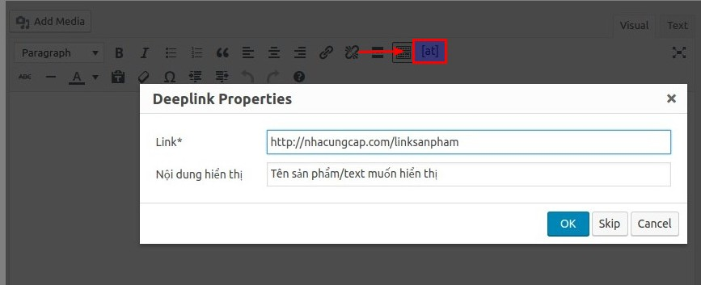
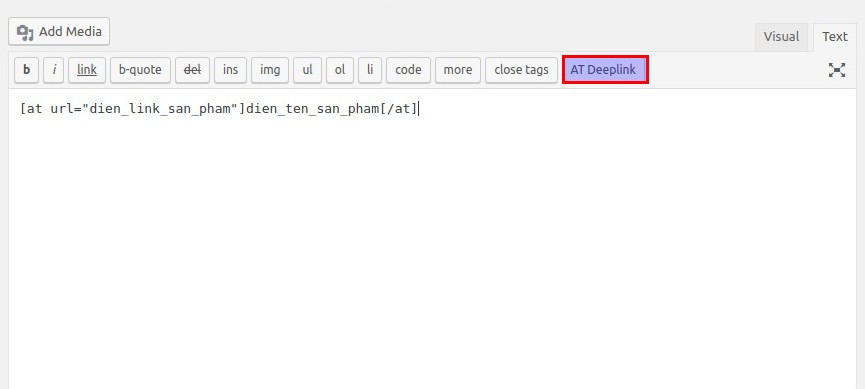

# accesstrade-deeplink
Shortcode generate AccessTrade deeplink

# Cài đặt

### Cách 1
Tải thư mục nhymxu-at-deeplink lên wp-content/plugins
Vào admin và active plugin
Vào Settings -> AccessTrade Deeplink để cài đặt AccessTrade User ID

### Cách 2
Tải bản đóng gói plugin ở 
Cài đặt plugin với file zip ở WordPress admin

# Cách dùng
Trong bài viết, điền theo format 
```
[at]http://linksanpham.com/abcdef[/at]
```
Hoặc nếu muốn đặt tiêu đề đặc biệt
```
[at url="http://linksanpham.com/abcdef"]Tên link hiển thị[/at]
```

# Ảnh demo thực tế




# Tác giả

* **Dũng Nguyễn**(aka nhymxu) - *Developer* - [Interspace Việt Nam](https://dungnt.net)

## Bản quyền

Dự án này được giữ bản quyền cho tác giả. Bạn được phép sử dụng miễn phí.
Mọi chỉnh sửa phân phối đều phải được sự đồng ý của tác giả.